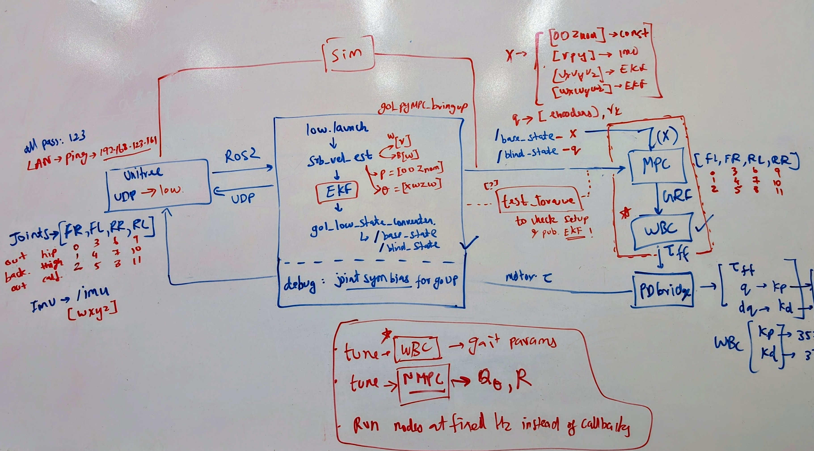
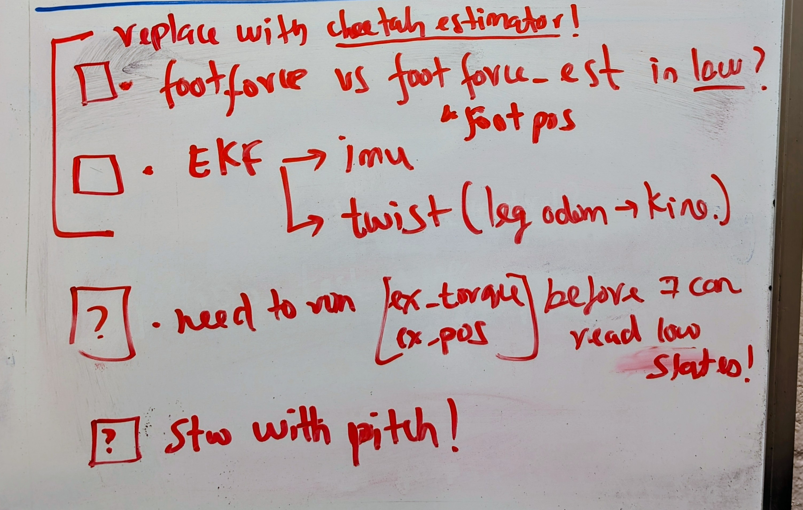

# go1_tools_low

ROS 2 tools for **Unitree Go1 low-level mode**. This package provides the low-state
conversion pipeline, basic torque tests, and a PD bridge for sending commands to
the hardware.

⚠️ Safety note:
- Add styrofoam protection around the robot to avoid damage in falls; impacts can damage the LAN port and the internal connection to the Raspberry Pi.

## Core Utilities (Low Mode)
This package focuses on basic low-level utilities first:
- Torque and Joint position test nodes for joint mapping validation.
- Standup controller script.
- PD bridge for sending torque commands to the hardware.
- PyMPC bringup launch to set the robot in low mode and publish basic state estimates.

How to run:
1) Torque test (use while the robot is hanging):
```
ros2 run go1_tools_low ros2_torque_example
```

2) Position example (use while the robot is hanging):
```
ros2 run go1_tools_low ros2_position_example
```

3) Standup controller:
```
ros2 run go1_tools_low ros2_standup_controller
```
⚠️ Standup controller is still under development.

4) PD bridge (torque output):
```
ros2 run go1_tools_low pympc_pd_bridge.py --ros-args -p enabled:=true -p use_ff_torque:=true -p kp:=0.0 -p kd:=3.0 -p tau_limit:=20.0
```

5) PyMPC bringup (state conversion + estimators):
```
ros2 launch go1_tools_low go1_pympc_bringup.launch.py
```

Outcome from hanging test:
- Validate joint position/torque mapping while the robot is suspended.
- Unitree low-level joint order is `FR FL RR RL`, while most MPC/WBC stacks use `FL FR RL RR`.

TODO 📝:
- Add a short video of the hanging torque test and mapping validation workflow.

PlotJuggler quick use:
```
ros2 run plotjuggler plotjuggler
```
Then add a ROS2 data stream and plot these topics as needed:
- `/low_state` (raw joint positions/velocities/torques)
- `/blind_state` (mapped joints)
- `/base_state` (base pose/velocity)
- `/imu` (orientation + angular velocity)
- `/quadruped_pympc_torques` (MPC torques)
- `/low_cmd` (commands sent to the robot)

Debug notes:
- If a low-level motor state reports `4`, the motor is unresponsive; restart the robot.
- In low mode, the IMU may not publish until you send a small torque command first.

## Low-Level Framework


## Low-Level TODO Map


## What It Provides
- Low state converter (`go1_low_state_converter.py`)
  - Publishes: `/base_state`, `/blind_state`, `/imu`, `/contacts`
  - Throttle output with `publish_rate_hz`
- SRB velocity estimator (`srb_velocity_estimator.py`)
  - Publishes `/twist_srb`
- EKF configs (robot_localization)
- Torque example node (`ros2_torque_example`)
- PD bridge (`pympc_pd_bridge.py`) sending `/low_cmd` at 500 Hz
- Launch: `go1_pympc_bringup.launch.py` (EKF + converter + SRB + PlotJuggler/RViz)

## Typical Usage
1) Launch low-level driver:
```
ros2 launch unitree_legged_real low.launch.py
```

2) Run bringup:
```
ros2 launch go1_tools_low go1_pympc_bringup.launch.py
```

3) Run MPC controller:
```
python3 ~/Quadruped-PyMPC/ros2/run_controller.py
```

4) Start PD bridge (torque output):
```
ros2 run go1_tools_low pympc_pd_bridge.py --ros-args -p enabled:=true -p use_ff_torque:=true -p kp:=0.0 -p kd:=3.0 -p tau_limit:=20.0
```

## PyMPC Integration (External)
We use the [Quadruped-PyMPC](https://github.com/urs-wues/Quadruped-PyMPC) repo as the current MPC + swing/stance controller. The typical flow is:
- Launch `go1_pympc_bringup.launch.py` to publish `/base_state`, `/blind_state`, `/imu`, and `/contacts`.
- Run the PyMPC controller: `Quadruped-PyMPC/ros2/run_controller.py`.
- Feed torques to hardware with `pympc_pd_bridge.py` (set `kp:=0.0` always).

Notes and nuances:
- The PyMPC controller behaves like a swing/stance controller (not a QP-WBC like legged_control).
- `pympc_pd_bridge.py` should receive `/quadruped_pympc_torques` from the controller.
- Review `Quadruped-PyMPC/quadruped_pympc/config.py` for MPC options (e.g., `mpc_params`, gait setup, costs).
- Go1 mass/inertia in `Quadruped-PyMPC/quadruped_pympc/config.py` may differ from the Unitree URDF.
  - Use `unitree_ws/scripts/compute_go1_inertia_pinocchio.py` to compute whole-body mass/inertia from the URDF.
  - Update the PyMPC config if needed and re-test.
- Use `publish_rate_hz` in `go1_low_state_converter.py` to match controller rates (e.g., 100 or 500 Hz).

Local PyMPC tweaks we use:
- `Quadruped-PyMPC/ros2/run_controller.py`:
  - Publish `/mpc_ref` and `/mpc_grf` for debugging/inspection.
  - Debug flag `FORCE_FLAT_TERRAIN_REF=True` to keep roll/pitch reference at zero.
- `Quadruped-PyMPC/quadruped_pympc/config.py`:
  - Go1 mass/inertia updated from the URDF (see the Pinocchio script above).

Experiments (not recommended):
- We modified loop settings in our local copy of `run_controller.py` (not in the upstream repo).
  - Tested `MPC_FREQ=100`, `WBC_LOOP_HZ=500` with defaults; unstable on hardware.

## MPC/WBC References
- [legged_control](https://github.com/qiayuanl/legged_control) — tested, works well; ROS + OCS2 dependencies make it heavier.
- [QUAD-MPC-SIM-HW](https://github.com/PMY9527/QUAD-MPC-SIM-HW) — tested, lean codebase; no ROS.
- [legged_mpc_control](https://github.com/zha0ming1e/legged_mpc_control)
- [walk-these-ways](https://github.com/Improbable-AI/walk-these-ways)
- [Cheetah-Software](https://github.com/mit-biomimetics/Cheetah-Software)

## Estimator Note
The current estimator setup is patchwork. We should move to a contact-based estimator
that uses leg kinematics for base velocity/pose estimation.

## MPC Node (Planned)
This package does not yet include a native ROS2 MPC node. The current working setup uses
`Quadruped-PyMPC/ros2/run_controller.py` externally. A future MPC node should:
- Subscribe to `/base_state` and `/blind_state`.
- Publish `/mpc_ref`, `/mpc_grf`, and `/quadruped_pympc_torques`.
- Run at a fixed MPC rate (e.g., 100 Hz) and interface with a higher-rate torque loop.

## Key Parameters
- `go1_low_state_converter.py`
  - `publish_rate_hz`: throttle output rate (e.g., 100 or 500)
  - `velocity_source`: `srb` or `ekf`
  - `use_joint_bias` + `joint_bias`: joint offset compensation

## TODO 📝
- Add MPC node as a ROS2 node.
- Add WBC node with Unitree Go1 gait library.
- Develop full autonomy stack.
- Fix standup controller to remove base tilt.
